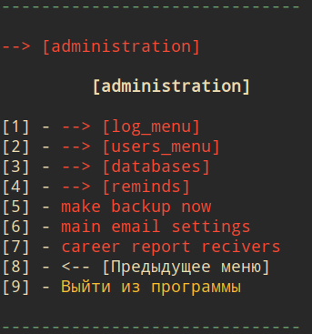
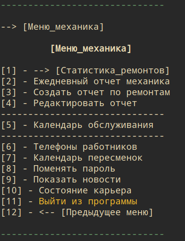

# Interkamen Program 
### ver 1.7.2

This is corporative program of mining company to work with statistic and financial reports.

## Getting Started

These instructions will get you a copy of the project up and running on your local machine for development and testing purposes. See deployment for notes on how to deploy the project on a live system.

### Prerequisites

For working with that program you need to install on your machine:
1. python 3.6+
And pythons frameworks:
1. pandas
2. matplotlib
3. openpyxl
4. Pillow

### Installing

1. Copy repository or download files on your computer.
2. Unzip data.zip (test datafile) in root folder of program.

## Built With

* [python3.6](https://www.python.org/) - Programming Language
* [pandas](https://pandas.pydata.org/) - Python Data Analysis Library
* [matplotlib](https://matplotlib.org/) - Python 2D plotting library
* [openpyxl](https://openpyxl.readthedocs.io/en/stable/#) - A Python library to read/write Excel 2010 xlsx/xlsm files
* [Pillow](https://pillow.readthedocs.io/en/5.3.x/) - PIL is the Python Imaging Library 

## Contributing

Please email to acetonen@gmail.com for details on our code of conduct, and the process for submitting pull requests to us.

## Versioning

We use [SemVer](http://semver.org/) for versioning.
### what's new in 1.0.1:
1. Remove 1,5 coefficient from buh. salary.
2. Add 'rock mass by month' plot in 'report_analysis'.
3. Colorful salary workers and drillers.
### what's new in 1.1.0:
1. Restructuring program files.
2. Add emailed module.
3. Add Email settings into administrator menu.
4. Add Mechanics report.
5. New administrator menus.
6. Make menu navigation simpler.
7. Add Email notifications for main report.
8. Add view reports by year in finance.
9. Add Employing date and penalties to workers.
### what's new in 1.1.1:
1. OOP style in pyplots.
2. Add "already exist" view for mechanics report.
3. Add brigadiers to salary list.
### what's new in 1.1.2:
1. Add availability to create drill report if main report not exist yet.
2. Fix backup bug.
### what's new in 1.2.0:
1. Add "edit report" in mechanics reports.
2. Remove 'exit by ENTER' from mechanics report.
3. Add correct check input hours in mechanics report.
4. Add more intuitive navigation in mechanic menu.
5. Add manual backup in administrator menu.
6. Replace txt backup log to pickle.
### what's new in 1.3.0:
1. Add maintenance calendar for mechanic.
2. Add reminder module.
3. Add reminder for maintenance.
4. Add 'stand reason' visualization to mechanics reports.
5. Fix bug in mechanics report when try to show stat and brigade 2 are empty.
6. Make backup after complete main report.
7. Merge stat_by_year and stat_by_month methods into stat_by_period.
### what's new in 1.4.0:
1. Add Brigade rating system.
2. Fix plots in report analysis module.
3. Move check_date_in_dataframe from mechanic_report to standart_functions.
4. Fix mechanic log.
5. Make standard date input.
6. Make submenus in admin meny by directions.
### what's new in 1.4.1:
1. Fix date view in mechanics report.
2. Fix error when you try show rating and haven't brigades results yet.
### what's new in 1.5.0:
1. Add Drill passport.
2. Fix check date format.
### what's new in 1.5.1:
1. Add Working calendar module.
2. Add notifications for create mechanics and drill report.
### what's new in 1.6.0:
1. Add career status module.
2. Add comma protect in all reports.
3. Add user with 'info' access.
### what's new in 1.6.1:
1. Make career status fill more user-friendly.
### what's new in 1.7.0:
1. Add news module.
2. Custom reminder.
3. Add stupid timer in master daily report.
### what's new in 1.7.1:
1. Fix news/ path bug.
2. Add exel dump for drill passport.
### what's new in 1.7.2:
1. Create new package to work with exl files.
2. Remake AbsPath module.
3. Fix daily report bug.

## Content and Instruction

### 1. Log in program
Content of program depend on user access. By default you have admin user access.
Admin user include in test data file.
To log in program:
Username: admin
Password: 0000
### 2. Main menu

In header of main menu you may see different remainder that depend on user 'access'.

From this menu you have access to different sub-menus (depend on user access) and basic functions such are: [6] - 'workers telephone numbers', [7] - 'change password', [8] - 'exit program'. Red menus are 'admin-only'

### 3. Admin menus

This menus give you access to:
1. read/delete/search in logs
2. create/delete/edit new user
3. create/show company structure
4. make backup of all data files
5. edit email notification and backup settings
### 4. Workers menu [5]

In this menu u can:
1. Create new worker
2. Show all workers from division
3. Show laying off workers (from worker archive)
4. Return worker from archive
5. Edit worker
6. Edit list of special workers category
7. Show anniversary workers
### 5. Statistic menu

In this menu u can:
1. Create main career report
2. Edit main career report
3. Show statistic of career results
4. Show statistic of career rockmass
5. Create drill instrument report
6. Show statistic of drill instrument
### 5. Financial  menu

In this menu u can:
1. Count workers salary
### 5. Financial  menu

In this menu u can:
1. Create repare report
2. Edit repare report
3. Show KTG and KTI statistic
4. Show Stand reasons statistic
5. Working with maintenance calendar

## Authors

* **Anton Kovalev** - *my gitHub* - [Acetonen](https://github.com/Acetonen/)

## License

This project is licensed under the GNU GPL v3.0  - see the [GNU](https://www.gnu.org/licenses/gpl-3.0.ru.html)

## Acknowledgments

* Thx [adw0rd](https://github.com/adw0rd) for great help.
