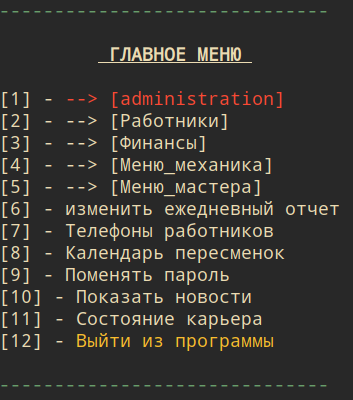
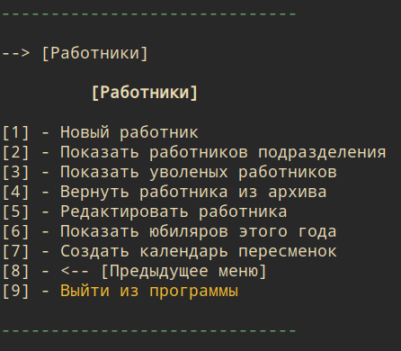
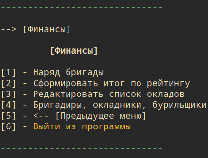

# Interkamen Program 1.1.2

This is corporative program of mining company to work with statistic and financial reports.

## Getting Started

These instructions will get you a copy of the project up and running on your local machine for development and testing purposes. See deployment for notes on how to deploy the project on a live system.

### Prerequisites

For working with that program you need to install on your machine:
1. python 3.6+
And pythons frameworks:
1. pandas
2. matplotlib

### Installing

1. Copy repository or download files on your computer.
2. Unzip data.zip (test datafile) in root folder of program.

## Built With

* [python3.6](https://www.python.org/) - Programming Language
* [pandas](https://pandas.pydata.org/) - Python Data Analysis Library
* [matplotlib](https://matplotlib.org/) - Python 2D plotting library

## Contributing

Please email to acetonen@gmail.com for details on our code of conduct, and the process for submitting pull requests to us.

## Versioning

We use [SemVer](http://semver.org/) for versioning.
### what's new in 1.0.1:
1. Remove 1,5 coefficient from buh. salary.
2. Add 'rock mass by month' plot in 'report_analysis'.
3. Colorful salary workers and drillers.
### what's new in 1.1.0:
1. Restructuring program files.
2. Add emailed module.
3. Add Email settings into administrator menu.
4. Add Mechanics report.
5. New administrator menus.
6. Make menu navigation simpler.
7. Add Email notifications for main report.
8. Add view reports by year in finance.
9. Add Employing date and penalties to workers.
### what's new in 1.1.1:
1. OOP style in pyplots.
2. Add "already exist" view for mechanics report.
3. Add brigadiers to salary list.
### what's new in 1.1.2:
1. Add availability to create drill report if main report not exist yet.
2. Fix backup bug.

## Content and Instruction

### 1. Log in program
Content of program depend on user access. By default you have admin user access.
Admin user include in test data file.
To log in program:
Username: admin
Password: 0000
### 2. Main menu

From this menu you have access to different sub-menus (depend on user access) and basic functions such are: [8] - 'workers telephone numbers', [9] - 'change password', [10] - 'exit program'. Red menus are 'admin-only'
### 3. Admin menus

This menus give you access to:
1. create/delete/edit new user
2. read/delete/search in logs
3. create/show company structure
### 4. Workers menu [5]

In this menu u can:
1. Create new worker
2. Show all workers from division
3. Show laying off workers (from worker archive)
4. Return worker from archive
5. Edit worker
6. Edit list of special workers category
### 5. Statistic menu

In this menu u can:
1. Create main career report
2. Edit main career report
3. Show statistic of career results by year
4. Create drill instrument report
5. Show statistic of drill instrument by year
### 5. Finansial  menu

In this menu u can:
1. Count workers salary

## Authors

* **Anton Kovalev** - *my gitHub* - [Acetonen](https://github.com/Acetonen/)

## License

This project is licensed under the GNU GPL v3.0  - see the [GNU](https://www.gnu.org/licenses/gpl-3.0.ru.html)

## Acknowledgments

* Thx [adw0rd](https://github.com/adw0rd) for great help.
